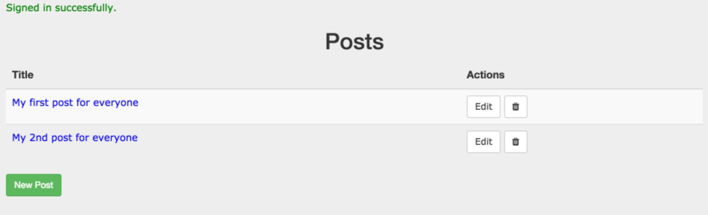
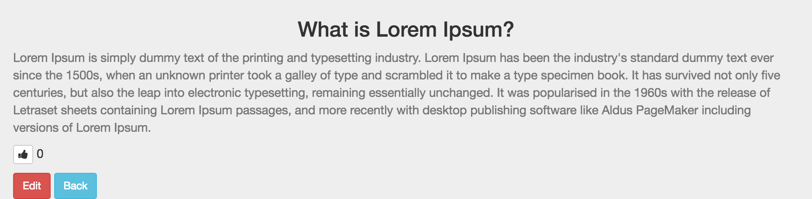
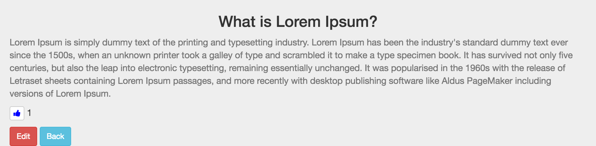

##  An Ajax Based Voting Application for Learning purpose

This application helps in understanding how rails ajax works. For demostrating this I am showcasing a voting app, where I have used [act_as_votable](https://github.com/ryanto/acts_as_votable) gem.

Here I am using a single method for liking and disliking a post as we never want the likes count to go below zero.

Whenever the user **likes a post**, the count increments by 1 and the color of the thumbs-up icon changes(just to show a visual change).

When the user clicks on an already liked post the count of likes reduces by one so we should use the **unliked_by** method provided by the gem.

For implementing this we can use an vote.js.erb file (*remember the file name should be same as your controller method name it makes the process easier, remember convention over configuration*).

Then in the `.js.erb` file we can mix `ruby` with `js` and have the desired result as shown in the `upvote.js.erb` file.

I add an extra class called `liked` which changes the color of the button.

**Please Note:** I am assuming that you have a single post on a page. If you have multiple posts on a page then you should add ID's to the posts container and similarly change the `js` code in the `upvote.js.erb` file.

### posts_controller.rb

      def vote
        if !current_user.liked? @post
          @post.liked_by current_user
        else
          @post.unliked_by current_user 
        end
      end 

### views/posts/vote.js.erb

    <% if current_user.liked? @post %>
	     $('.votingBtn > a').addClass('liked');
    <% else %>	
	     $('.votingBtn > a').removeClass('liked');
    <% end %>	
    $('.votingBtn  .voteCount').html('<%= @post.get_likes.size %>');

### view.html.erb
    <!-- Adding a class liked -->
    

      <!-- Adding a helper method in posts_helper.rb to determine whether the user has already voted or not -->
      <%= link_to vote_post_url(@post), class: "btn btn-xs btn-default  #{liked_or_not}", method: 'put', remote: true do %>
	<i class="fa fa-thumbs-up "></i>
      <% end %>
      <%= @post.get_likes.count %>
     

